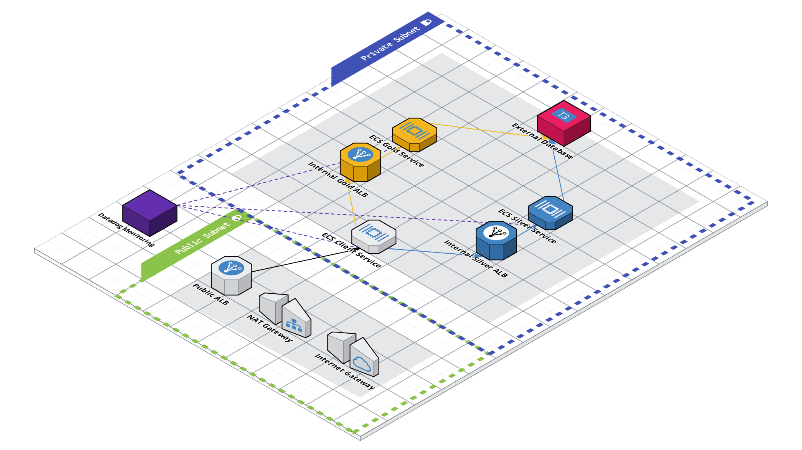
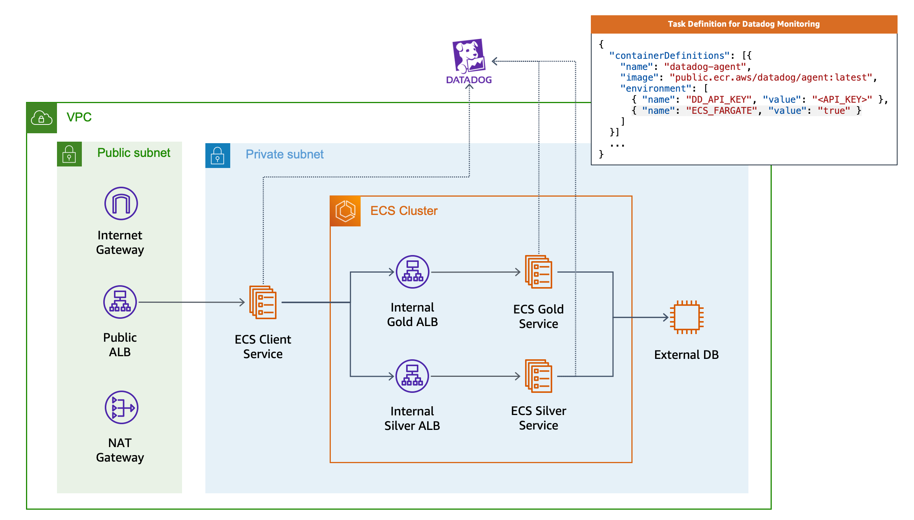

# AWS ECS Microservices with CDK for Terraform

This project creates a microservice architecture on AWS ECS Fargate with Datadog monitoring using the CDK for Terraform.  It seeks to follow a familiar pattern used by vanilla Terraform projects - flat file structure, declarative paradigm, and simplicity. 

## The Architecture




All services use [Fake Service](https://github.com/nicholasjackson/fake-service) as placeholders.  You can swap them out with your own containerized services.  You will need to change around port configurations and security groups to afford your applications' needs.

## Getting Started

For this you'll need 4 things:

- AWS Account and Credentials
- Terraform
- Terraform Cloud Account
- Node.js
- CDKTF
- Datadog Account and Credentials

Instructions below:

### 1. AWS Account and Credentials

AWS is used to host the infrastructure.  Surprise.

1. Have an [AWS Account](https://aws.amazon.com/).

2. Have the [AWS CLI Installed](https://docs.aws.amazon.com/cli/latest/userguide/getting-started-install.html).

3. Create an [AWS IAM User](https://docs.aws.amazon.com/IAM/latest/UserGuide/getting-started_create-admin-group.html) with Admin or Power User Permissions.
  - this user will only be used locally

4. [Configure the AWS CLI](https://docs.aws.amazon.com/cli/latest/userguide/cli-chap-configure.html) with the IAM User from Step 4.
  - Terraform will read your credentials via the AWS CLI 
  - [Other Authentication Methods with AWS and Terraform](https://registry.terraform.io/providers/hashicorp/aws/latest/docs#authentication)

### 2. Terraform, Terraform Cloud, and the CDK for Terraform

Terraform and CDKT for Terraform are used to provision the infrastructure.  Terraform Cloud (free) is used to manage your state.

1. Install [HashiCorp Terraform](https://www.terraform.io/downloads).

2. Install [Node.js](https://nodejs.org/en/).

3. Install the [CDK for Terraform](https://learn.hashicorp.com/tutorials/terraform/cdktf-install?in=terraform/cdktf)

4. Sign up for [Terraform Cloud](https://app.terraform.io/public/signup/account?utm_content=offers_tfc&utm_source=jcolemorrison)
  - yo its free for 5 team members

5. Create a [Terraform Cloud Organization](https://learn.hashicorp.com/tutorials/terraform/cloud-sign-up?in=terraform/cloud-get-started)

6. Log in to [Terraform Cloud from the CLI](https://learn.hashicorp.com/tutorials/terraform/cloud-login?in=terraform/cloud-get-started)
  - this will set the credentials locally for the CDKTF to work with it

7. Export your Terraform Cloud Organization name as an environment variable:
  ```sh
  # Don't forget to set this!  Used in main.ts @line 153
  $ export CDKTF_ECS_TFC_ORGANIZATION="your TFC organization name"
  ```

### 3. DataDog Account and Credentials

Datadog is used for monitoring and alerts across your ECS Cluster and Services.

1. Have a [Datadog Account](https://www.datadoghq.com/).

2. Export your[ Datadog API and APP Keys](https://docs.datadoghq.com/account_management/api-app-keys/) as Environment Variables.
  ```sh
  # Keys found and created in app.datadoghq.com -> organization settings 
  # # -> api keys
  # # -> application keys
  $ export DD_API_KEY="<your_api_key>"
  $ export DD_APP_KEY="<your_app_key>"
  ```

## Deploying the Project

1. Clone this repo.

2. Run `npm i` to install all dependencies.

3. Run `cdktf synth` to ensure no errors are occuring.

4. Run `cdktf deploy` and accept the deployment.

5. Grab the URL from your `client_service_endpoint` Terraform Output and visit it to see the application.

6. Optionally add `/ui` to your `client_service_endpoint` to see a visualization of your services.

7. Optionally visit your Datadog account to see your monitor and dashboard for cluster CPU usage.
---

